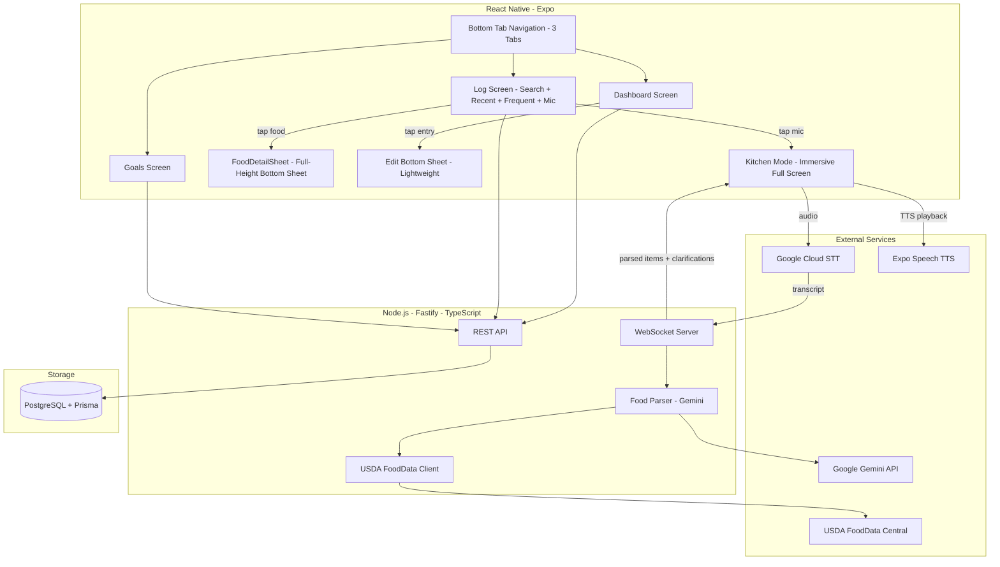

# MacroTrack MVP -- Full Build Plan

## Architecture




## Tech Stack

- **Frontend**: React Native (Expo), Expo Router (file-based routing), Zustand (state), Expo Speech (TTS)
- **Backend**: Node.js, Fastify, TypeScript, Prisma ORM, ws (WebSockets)
- **Database**: PostgreSQL
- **AI**: Google Gemini API (natural language parsing, edit/remove detection, clarification, meal categorization, voice-guided custom food creation). The AI does NOT generate or estimate nutritional data -- it only works with existing data from USDA or user-created custom foods.
- **Voice**: Google Cloud Speech-to-Text (streaming, auto-segmentation on pauses)
- **Food Data**: USDA FoodData Central API + user-created custom foods (stored in PostgreSQL)

## Navigation (3 Bottom Tabs)

- **Dashboard** (home): Macro progress bars at top, food entries grouped by auto-assigned meal below
- **Log**: Search bar + frequent/recent foods + mic button -- the single hub for all food logging
- **Goals**: Set daily calorie, protein, carbs, fat targets

No separate Search tab. The Log tab combines search, manual entry, and voice session access in one place.

## Screen-by-Screen Design

### 1. Dashboard (Home Tab)

- **Top section**: Macro progress bars (calories, protein, carbs, fat) showing current vs daily goal, with numeric "remaining" values
- **Below**: Food entries for today, grouped by auto-assigned meal (Breakfast, Lunch, Dinner, Snack)
- **Each entry row**: Food name, quantity + unit, calorie count, small source indicator icon (database / custom)
- **Tap an entry**: Opens a lightweight bottom sheet with editable quantity, unit, and a delete button. Save to update.
- **Swipe left on an entry**: Quick-delete with confirmation
- **Design**: Minimal, clean, generous white space (Apple Health aesthetic)

### 2. Log Screen (Log Tab)

The single hub for all food logging -- manual, voice, and custom food creation.

**Layout (top to bottom):**

- **Search bar** at top: "Search foods..." -- searches both USDA database AND user's custom foods, results appear inline replacing the sections below
- **"Create Food" button**: Always visible next to or below the search bar -- opens the CreateFoodSheet for adding a custom food
- **"Frequent" section**: Most frequently logged foods (the user's staples, including custom foods), each row shows food name + last-used quantity + a "+" quick-add button
- **"Recent" section**: Last N foods logged (chronological, most recent first), same row format
- **Mic button**: Large, prominent button fixed at the bottom center of the screen

**Search results behavior:**

- Custom foods appear at the top of results, visually grouped with a "My Foods" header
- USDA results appear below with a "Database" header
- When no results match, a prominent "Create [query] as custom food" option appears, pre-filling the name field in CreateFoodSheet

**Manual logging flow:**

1. User types in the search bar (or taps a frequent/recent food)
2. A **full-height bottom sheet** slides up (the FoodDetailSheet) showing:
  - Food name and source label (USDA database / Custom)
  - Full nutrition breakdown (per serving and per 100g)
  - Quantity input field
  - Unit selector (grams, oz, cups, servings, etc.)
  - "Add" button
3. User sets quantity, taps Add
4. Sheet dismisses, user stays on Log tab to add more items
5. Meal label is auto-assigned by time of day (no picker needed)

**Custom food creation flow:**

1. User taps "Create Food" button (or the "Create [query] as custom food" fallback in search results)
2. **CreateFoodSheet** (full-height bottom sheet) opens with fields:
  - **Required**: Name, serving size + unit, calories, protein (g), carbs (g), fat (g)
  - **Optional expandable section** ("More details"): sodium (mg), cholesterol (mg), fiber (g), sugar (g), saturated fat (g), trans fat (g), etc.
3. User fills in fields, taps "Save Food"
4. Custom food is persisted and immediately available in search, frequent, and recent lists
5. Source is marked as `CUSTOM` across the app

**Voice logging entry:**

1. User taps the mic button
2. Kitchen Mode launches as a full-screen immersive overlay (tab bar hidden)

### 3. Kitchen Mode (Immersive Voice Session)

This is the core feature. Full-screen, hides all navigation.

**Layout (top to bottom):**

- **Macro summary bar** (pinned top): Compact single row showing "1,450 / 2,200 cal | 85g P left | 120g C left | 30g F left"
- **Draft meal cards** (scrollable center area): Cards pop in as items are recognized
  - Each card shows: food name, quantity + unit, calorie/protein/carbs/fat, source indicator (database icon vs custom icon)
  - When AI asks a clarification, the relevant card **highlights/pulses** and the question text appears on the card itself (e.g., eggs card shows "How many?")
  - **"Creating" cards**: When no match is found and the user opts to create a custom food by voice, the card enters a special "creating" state that fills in field by field as the user speaks the nutrition info
  - Cards are **tappable** for manual fallback editing (inline quantity field, unit, delete button)
- **Listening indicator** (bottom area): Visual waveform or pulsing dot showing the mic is active
- **Controls**: "Save" button and "Cancel" button, flanking the listening indicator. Also responds to voice commands: "done" / "save that" / "cancel"

**Voice interaction flow:**

1. Mic activates, continuous listening with **auto-segmentation on natural pauses**
2. Each utterance segment is sent via **WebSocket** to the backend
3. Backend sends transcript to **Gemini** with structured prompt + current draft context. Gemini returns one of:
  - `ADD_ITEMS`: list of `{ name, quantity, unit }` objects to add
  - `EDIT_ITEM`: identifies which existing draft item to modify and how
  - `REMOVE_ITEM`: identifies which draft item to remove
  - `CLARIFY`: a question to ask + which draft item it concerns
  - `SESSION_END`: user said "done", "save that", "that's it", etc.
4. For `ADD_ITEMS`: backend looks up each item in this priority order:
  - **Custom foods first**: check user's custom foods for a match → `source = CUSTOM`
  - **USDA FoodData Central**: search the database → `source = DATABASE`
  - **AI fallback**: Gemini generates an approximation → `source = AI_ESTIMATE`
5. Results streamed back via WebSocket, cards appear/update on screen in real-time
6. For `CLARIFY`: the relevant card highlights, **TTS speaks the question aloud** (via Expo Speech), system waits for the user's verbal response
7. For errors/unrecognized speech: TTS says "I didn't catch that, could you say it again?" + a pending card appears with the raw text (user can tap to manually resolve)
8. Gemini auto-assigns a **meal label** (breakfast/lunch/dinner/snack) based on time of day provided in prompt context
9. User says "done" or taps Save → all draft items are persisted as FoodEntries → app returns to **Dashboard** (showing updated macro progress)

**Edit by voice examples:**

- "actually make that 3 eggs" → `EDIT_ITEM` on eggs card, quantity becomes 3
- "not 30 grams, 13" → `EDIT_ITEM` on the most recently discussed item, quantity becomes 13
- "change the rice to 200 grams" → `EDIT_ITEM` on rice card
- "remove the butter" → `REMOVE_ITEM` on butter card

### 4. FoodDetailSheet (Shared Component)

A full-height bottom sheet used in two contexts:

**When adding from Log tab (search result, frequent, or recent food):**

- Food name (large), source label (USDA / Custom / AI Estimate)
- Nutrition table: calories, protein, carbs, fat (per serving and per 100g)
- Optional nutrition details if available (sodium, cholesterol, fiber, sugar, etc.)
- Quantity input + unit selector
- "Add" button

**When editing from Dashboard (tap an entry):**

- Same layout but pre-filled with the entry's current values
- Button reads "Save" instead of "Add"
- Includes a "Delete" option

### 5. CreateFoodSheet (Custom Food Creation)

A full-height bottom sheet for creating user-defined foods.

- **Required fields**: Name, serving size (quantity + unit), calories, protein (g), carbs (g), fat (g)
- **Optional section** (collapsible "More details"): sodium (mg), cholesterol (mg), fiber (g), sugar (g), saturated fat (g), trans fat (g)
- "Save Food" button at bottom
- On save, food is persisted to CustomFood table and immediately searchable
- If opened from a no-results search fallback, the name field is pre-filled with the search query

### 6. Goals Screen

- Input fields for daily targets: Calories, Protein (g), Carbs (g), Fat (g)
- Save button persists goals
- These values feed the progress bars on the Dashboard and the macro summary bar in Kitchen Mode

## Database Schema (Prisma)

```prisma
model User {
  id          String        @id @default(uuid())
  name        String        @default("User")
  createdAt   DateTime      @default(now())
  goal        DailyGoal?
  entries     FoodEntry[]
  customFoods CustomFood[]
  sessions    VoiceSession[]
}

model DailyGoal {
  id       String @id @default(uuid())
  userId   String @unique
  user     User   @relation(fields: [userId], references: [id])
  calories Int
  proteinG Int
  carbsG   Int
  fatG     Int
}

model CustomFood {
  id            String   @id @default(uuid())
  userId        String
  user          User     @relation(fields: [userId], references: [id])
  name          String
  servingSize   Float
  servingUnit   String
  calories      Float
  proteinG      Float
  carbsG        Float
  fatG          Float
  // Optional extended nutrition fields
  sodiumMg      Float?
  cholesterolMg Float?
  fiberG        Float?
  sugarG        Float?
  saturatedFatG Float?
  transFatG     Float?
  createdAt     DateTime @default(now())
  updatedAt     DateTime @updatedAt
}

model FoodEntry {
  id           String   @id @default(uuid())
  userId       String
  user         User     @relation(fields: [userId], references: [id])
  date         DateTime @default(now())
  mealLabel    String   // breakfast, lunch, dinner, snack
  name         String
  calories     Float
  proteinG     Float
  carbsG       Float
  fatG         Float
  quantity     Float
  unit         String
  source       String   // DATABASE, CUSTOM, or AI_ESTIMATE
  usdaFdcId    Int?
  customFoodId String?
  createdAt    DateTime @default(now())
}

model VoiceSession {
  id        String   @id @default(uuid())
  userId    String
  user      User     @relation(fields: [userId], references: [id])
  startedAt DateTime @default(now())
  endedAt   DateTime?
  status    String   @default("active") // active, completed, cancelled
}
```

## Backend API

**REST endpoints:**

- `GET /api/goals` -- get current daily goals
- `PUT /api/goals` -- set/update daily goals
- `GET /api/food/entries?date=YYYY-MM-DD` -- get entries for a given day
- `GET /api/food/entries/frequent` -- get most frequently logged foods
- `GET /api/food/entries/recent` -- get recently logged foods
- `POST /api/food/entries` -- manually log a food entry
- `PUT /api/food/entries/:id` -- edit an entry (quantity, unit, name)
- `DELETE /api/food/entries/:id` -- delete an entry
- `GET /api/food/search?q=chicken+breast` -- **unified search**: queries user's custom foods first (grouped under "My Foods"), then USDA FoodData Central (grouped under "Database")
- `GET /api/food/custom` -- list all user's custom foods
- `POST /api/food/custom` -- create a custom food
- `PUT /api/food/custom/:id` -- edit a custom food
- `DELETE /api/food/custom/:id` -- delete a custom food

**WebSocket `/ws/voice-session`:**

- Client sends: `{ type: "transcript", text: "200 grams of chicken breast and a cup of rice" }`
- Server responds: `{ type: "items", items: [...], mealLabel: "dinner" }` or `{ type: "clarify", itemIndex: 0, question: "How many eggs?" }` or `{ type: "error", rawText: "...", message: "..." }`

## Gemini Prompt Strategy

System prompt for the food parser instructs Gemini to:

- Accept natural language food descriptions and return structured JSON
- Detect intent: adding items, editing an existing item, removing an item, or needing clarification
- Assign a meal label based on time of day (provided in prompt context) and food type
- When generating approximations, include a per-100g breakdown
- Handle corrections naturally ("not 30, 13", "actually make that 3", "change rice to 200 grams")
- Only ask clarifying questions when truly ambiguous (missing quantity for countable items)
- Return structured JSON with action type and payload

The food parser orchestrator uses this lookup priority: **custom foods → USDA database → AI approximation**. This ensures the user's own foods (which may have personalized names like "Mom's chili" or local brand names) are matched first.

## Project Structure

```
MacroTracker/
  mobile/                         # Expo app
    app/
      _layout.tsx                 # Root layout + tab navigator (3 tabs)
      (tabs)/
        index.tsx                 # Dashboard (home)
        log.tsx                   # Log screen (search + frequent + recent + mic)
        goals.tsx                 # Goal setting
      kitchen-mode.tsx            # Full-screen immersive modal (no tabs visible)
    components/
      FoodDetailSheet.tsx         # Full-height bottom sheet: nutrition info + quantity/unit + Add/Save
      CreateFoodSheet.tsx         # Full-height bottom sheet: custom food creation form
      EditEntrySheet.tsx          # Lightweight bottom sheet for editing from Dashboard
      DraftMealCard.tsx           # Individual food card in kitchen mode
      MacroProgressBar.tsx        # Single macro progress bar
      MacroSummaryBar.tsx         # Compact remaining-macros bar for kitchen mode top
      FoodEntryRow.tsx            # Food entry row in dashboard list (swipe-to-delete)
      FoodSearchResult.tsx        # Search result row in Log tab
      FrequentFoodRow.tsx         # Frequent/recent food row with quick-add
      MealGroup.tsx               # Meal group header + entries on dashboard
      ListeningIndicator.tsx      # Mic active waveform/pulse indicator
      PendingCard.tsx             # Unmatched/error card in kitchen mode
    services/
      api.ts                      # REST API client (fetch wrapper)
      voiceSession.ts             # WebSocket client for voice sessions
      speech.ts                   # Google Cloud STT streaming + Expo Speech TTS helpers
    stores/
      draftStore.ts               # Zustand store for kitchen mode draft state
      dailyLogStore.ts            # Zustand store for dashboard data + frequent/recent foods
      goalStore.ts                # Zustand store for goals
    constants/
      theme.ts                    # Colors, typography, spacing (minimal/clean palette)
    package.json
  server/
    src/
      routes/
        food.ts                   # Food entry CRUD + unified search + frequent/recent queries
        customFood.ts             # Custom food CRUD routes
        goals.ts                  # Goals CRUD routes
      services/
        gemini.ts                 # Gemini API client + structured prompts
        usda.ts                   # USDA FoodData Central client
        foodParser.ts             # Orchestrator: transcript -> structured food items
      websocket/
        voiceSession.ts           # WebSocket handler for real-time voice sessions
      db/
        prisma/
          schema.prisma
      app.ts                      # Fastify app setup
      server.ts                   # Entry point
    package.json
```

## Implementation Order

Build in this order to get a working vertical slice as early as possible:

1. **Scaffold both projects** -- Expo app + Fastify server, TypeScript configs, dependencies, 3-tab navigation shell
2. **Database + Prisma schema** -- User, DailyGoal, FoodEntry, CustomFood, VoiceSession models + PostgreSQL connection
3. **USDA service** -- search by query + parse nutrient response (independent, testable)
4. **Gemini service** -- structured system prompt, food parsing with intent detection (independent, testable)
5. **Food parser orchestrator** -- wires Gemini + USDA + custom food lookup together: transcript in, structured items out (priority: custom → USDA → AI estimate)
6. **REST API** -- goals CRUD, food entry CRUD, custom food CRUD, unified search (custom + USDA), frequent/recent queries
7. **Goals screen** -- simplest UI screen, proves the API connection works end-to-end
8. **FoodDetailSheet + CreateFoodSheet** -- full-height bottom sheets: FoodDetailSheet for viewing/logging foods, CreateFoodSheet for custom food creation (required + optional nutrition fields)
9. **Dashboard** -- macro progress bars + meal-grouped food list + tap-to-edit (EditEntrySheet) + swipe-to-delete
10. **Log screen** -- search bar with unified results (My Foods + Database groups), "Create Food" button, Frequent + Recent sections, no-results "Create as custom food" fallback, mic button; tapping food opens FoodDetailSheet
11. **WebSocket voice session handler** -- backend side: receive transcripts, invoke food parser (with custom food priority), stream results
12. **Kitchen Mode** -- immersive full-screen: Google Cloud STT streaming, WebSocket integration, draft cards (with CUSTOM/DATABASE/AI_ESTIMATE source badges), TTS clarifications, voice + tap editing, save/cancel flow, return to Dashboard
13. **Polish** -- error states, loading indicators, empty states, pending card interactions, visual consistency

